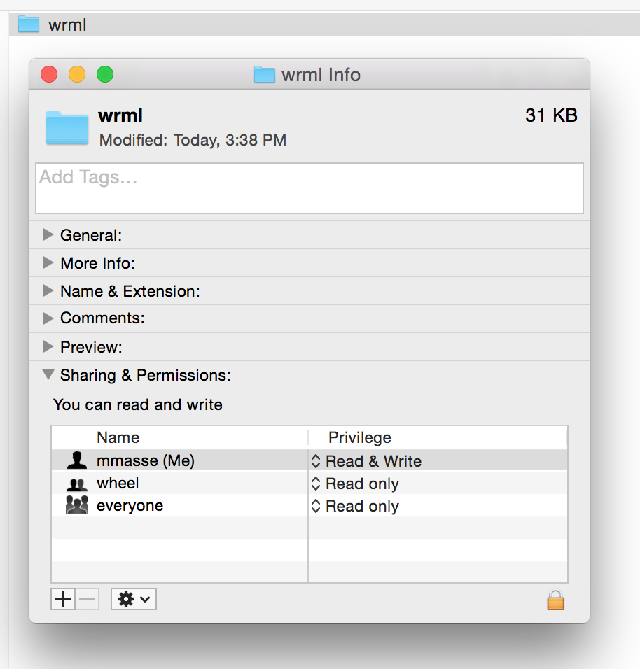
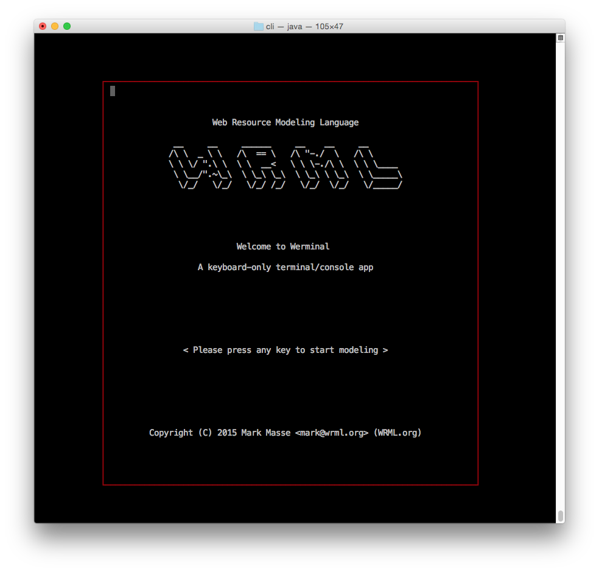

  

# About
WRML, the Web Resource Modeling Language, is an open source software project (http://www.wrml.org) focused on providing tools to support the development of RESTful client-server applications. 

The initial implementation of the WRML runtime is Java-based, with the WrmlServlet providing the REST API engine that frees the service developer to focus on application logic.

# Key Benefits

WRML offers a _REST API engine_ that promotes a design first approach to REST API development. It does this by treating REST API design metadata (think swagger JSON) as primary input "model" to power the REST API server's runtime. The following list highlights some of WRML's "key benefits" - what differentiates a WRML-based REST API server from a JAX-RS (or other modern framework) approach?

* WRML REST API servers load API design metadata (again, think swagger JSON) and initialize _runtime_ REST API models which are used  for request routing and HATEOAS (see below)

* Since the server literally _runs_ your API designs (API design metadata expressed as JSON), your documentation and tools like Swagger will never "drift" from the running API - the REST API design's JSON representation is never stale, it becomes the source of truth

* The server generates hyperlinks in responses based upon the designs of the API and the response document’s Schema (HATEOAS!)

* The server routes incoming requests to a configured “back-end” **Service** implementation class based upon the target API endpoint’s response document’s **Schema** - learning this simple Service interface will enable you to hook up any backend to WRML's powerful REST API "frontend". 

* The server represents response documents using any configured format (e.g. JSON) - formats are pluggable and can be easily added

* To reduce the number of requests per screen, supports embedding linked document(s) within the requested document

* To reduce the byte size of responses, supports omission of unused properties from the requested document

* Exposes API and Schema metadata to automate generation of code and docs for clients and intermediaries - for instance, the WRML server represents the loaded API design metadata in Swagger format so it can be easily used with WRML

# Getting Started

*Getting started* with WRML means something a little bit different to each role involved in the creation of REST APIs.

The remainder of this README is intended for developers or other folks wanting to download, build, install, and run the WRML server and/or client tools.

## Before you install WRML

From a console/terminal window, verify that *Java 7* is installed:

	$> java -version

Which should display something like this (with a "1.7.0" or higher version number - 1.8.* is cool too):

	java version "1.7.0_25"

If not, it can be downloaded from: http://www.oracle.com/technetwork/java/javase/downloads/jdk7-downloads-1880260.html

Also verify that *Maven 3* is installed:

	$>  mvn -version

Which should display something like this:

    Apache Maven 3.3.3 (7994120775791599e205a5524ec3e0dfe41d4a06; 2015-04-22T04:57:37-07:00)

If not, it can be downloaded from: http://maven.apache.org/download.cgi

## Download WRML

	$> git clone git@github.com:wrml/wrml.git

## Install WRML

Change to the root directory of the WRML project.

	$> cd wrml

From the root directory run maven's install command.
	
	$> mvn install

Please note that the first time you run this command, it may download several of WRML's dependencies and install them into your system's local maven repository.

## Configure WRML

Edit the WRML configuration file at **wrml/config/filesystem-wrml.json** to match your local environment. The default contents of the configuration file are shown below:
    
	{
	    "context": {
	
	        "schemaLoader": {
	
	            "schemaClassRootDirectory": "/etc/wrml/schemas"
	        },
	
	        "serviceLoader": {
	            "services": [
	                {
	                    "name": "File",
	                    "implementation": "org.wrml.runtime.service.file.FileSystemService",
	                    "settings": {
	                        "rootDirectory": "/etc/wrml/models"
	                    }
	                }
	            ],
	
	            "serviceMapping": {
	
	                "*": "File"
	            }
	        }
	    }
	}

## File Service Root Directory

This setting specifies the root directory for WRML models, which are individual Object instances stored as JSON files on disk.

	"rootDirectory" : "/etc/wrml/models"
	
You may edit this line to refer to a different directory or keep it as is to accept the default. In either case, ensure that this directory **exists** and it and its subdirectories are **readable & writable** by you.

  

	

## Schema Loader Schema Directory

This setting specifies the root directory for WRML Schemas as Java interfaces with bytecode dynamically generated (only once).

	"schemaClassRootDirectory" : "/etc/wrml/schemas"

You may edit this line to refer to a different directory or keep it as is to accept the default. In either case, ensure that this directory **exists** and it and its subdirectories are **readable & writable** by you.

# Werminal - WRML Terminal

The WRML server and its "REST API engine" cover a decent chunk of what every REST API server needs to have. Beyond that, the WRML core (internals of the server) supports REST API and Schema design by creating design metadata and putting it all together. To test these features and capabilities and to interact with the WRML core directly, I built _Werminal_ to demonstrate that the bulk of the cabilities of the WRML server come from the WRML core, which Werminal, as a Java-based client, has baked in.

Werminal is a terminal (command line) application for WRML model browsing and editing. Werminal can be used to create new models of any type such as: Schemas, Teams, Players, Aliens, HomeScreens, Movies; whatever your application calls for. Werminal also enables you to open, edit, and save data (of any data type).

  

## Running Werminal

From the project root directory of the WRML project, change to the *cli* subdirectory.

    $> cd cli
    $> ./werminal

The **werminal** command runs Werminal with the following command: 

    java -DwrmlConfiguration=../config/filesystem-wrml.json -classpath "target/wrml-cli.jar" org.wrml.werminal.Werminal -unix

Werminal starts by dispaying the splash screen (shown below). From here you may press any key to start interacting with WRML. 

  

If you have problems starting Werminal, please confirm that the WRML configuration file is using the correct "slash" leaning direction for the folder/directory paths match the conventions of your OS. In WRML config files, the "/" forward slash should work cross-platform.

For more information about running Werminal, see <a href="./cli/README.md">the Werminal /cli project README.</a>

## wrmldoc

See the <a href="./wrmldoc/README.md">/wrmldoc project</a>.

# License
WRML is copyright (C) 2012-2015 Mark Masse <mark@wrml.org> (OSS project WRML.org). WRML is licensed under the Apache License, Version 2.0. You may obtain a copy of the License at: http://www.apache.org/licenses/LICENSE-2.0

