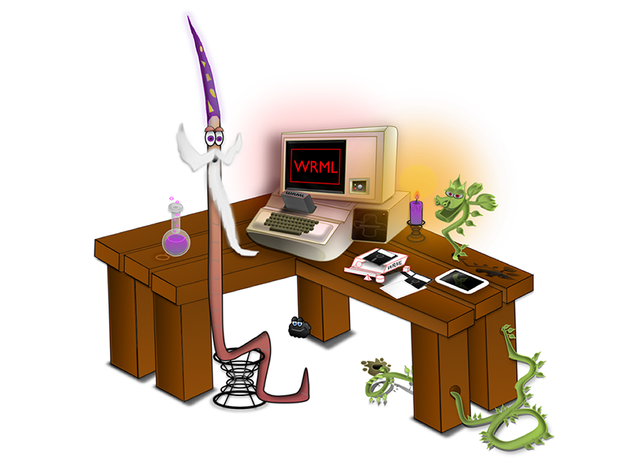

  

#About
WRML, the Web Resource Modeling Language, is a domain-specific modeling language that's oriented toward the design of REST APIs. It is a formalization of common REST API design and implementation patterns found in modern application servers. 

WRML is an open source software project (http://www.wrml.org) focused on providing REST API standards, frameworks, and tools to support the development of web-oriented, client-server applications.

The initial implementation of the WRML runtime is Java-based, with the WrmlServlet providing the REST API engine that frees the service developer to focus on application logic.

#Key Benefits

* Loads and initializes REST API models (design metadata) to be routed and invoked

* Routes requests to a configured “back-end” Service based upon the target API endpoint’s response document’s Schema

* Generates hyperlinks in responses based upon the designs of the API and the response document’s Schema

* Represents response documents using a configured Format (e.g. JSON)

* To reduce the number of requests per screen, supports embedding linked document(s) within the requested document

* To reduce the byte size of responses, supports omission of unused properties from the requested document

* Exposes API and Schema metadata to automate generation of code and docs for clients and intermediaries

#Getting Started

*Getting started* with WRML means something a little bit different to each role involved in the creation of REST APIs.

To those wanting to get started with the tools and find a link to download an installer (from an app store) or use a JS web app for REST API design - that documentation is still a work in progress.

The remainder of this README is intended for developers or other folks wanting to download, build, install, and run WRML.

Before you install WRML
-----------------------

From a console/terminal window, verify that *Java 7* is installed:

	$> java -version

Which should display something like this (with a "1.7.0" or higher version number):

	java version "1.7.0"
	Java(TM) SE Runtime Environment (build 1.7.0-b147)
	Java HotSpot(TM) 64-Bit Server VM (build 21.0-b17, mixed mode)

If not, it can be downloaded from: http://www.oracle.com/technetwork/java/javase/downloads/jdk7-downloads-1880260.html

Also verify that *Maven 3* is installed:

	$>  mvn -version

Which should display something like this:

	Apache Maven 3.0.5 (r01de14724cdef164cd33c7c8c2fe155faf9602da; 2013-02-19 05:51:28-0800)

If not, it can be downloaded from: http://maven.apache.org/download.cgi

Download WRML
-------------

	$> git clone git@github.com:wrml/wrml.git

Install WRML
------------

From the root directory (WRML_HOME) run maven's install command.

	$> mvn install

Please note that the first time you run this command, it may download several of WRML's dependencies and install them into your system's local maven repository.

Configure WRML
--------------

Edit the WRML configuration file (wrml.json) to match your local environment. In the example below, these two lines are the important ones to match to your system:

File Service Root Directory
---------------------------
This setting specifies the root directory for WRML Models (stored as JSON files on disk).

	"rootDirectory" : "E:/wrml/models/"

Schema Loader Schema Directory
------------------------------

This setting specifies the root directory for WRML Schemas (compiled as Java interfaces).

	"schemaClassRootDirectory" : "E:/wrml/schemas"

For those having problems starting WRML, please confirm that the "slash" leaning direction of the folder/directory paths match the conventions of your OS. In java config files, the "/" forward slash should work cross-platform, but the java commands listed below contain path's like "..\core\target\core-1.0-SNAPSHOT.jar;" which are both Windows-centric (backslashes) and relative to the WRML_HOME/bin folder.

In lieu of an installer, please adjust config and script files according to match your environment.

#WRML Tools#

##Werminal - WRML Model Editor##

See <a href="./cli/README.md">the Werminal /cli project README.</a>

For more about the Werminal app, please consult the "Werminal Masters Handbook": https://github.com/wrml/wrml/blob/master/doc/WRML_WerminalMastersHandbook.pdf

##wrmldoc##

See the /wrmldoc project.

#License#
WRML is copyright (C) 2012-2013 Mark Masse <mark@wrml.org> (OSS project WRML.org). WRML is licensed under the Apache License, Version 2.0. You may obtain a copy of the License at: http://www.apache.org/licenses/LICENSE-2.0

  

